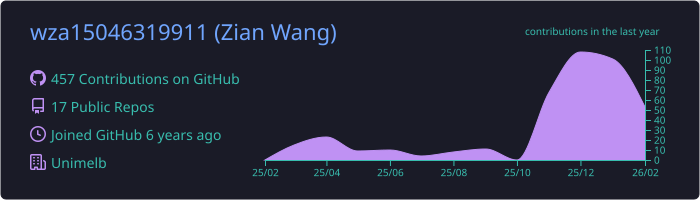
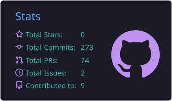
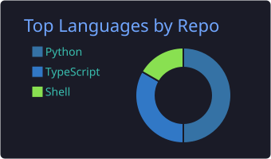
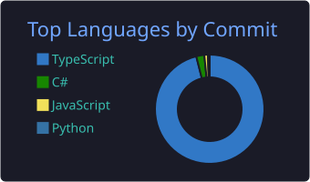
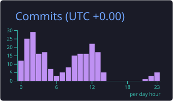

<div align="center">


<br />

<a href="https://lewiswang.com.au"></a>
<a href="https://www.linkedin.com/in/zian-wang-39081b225/"></a>
<a href="mailto:zianwang9911@gmail.com"></a>
<a href="https://github.com/lewiswang0516/lewiswang0516/blob/main/public/Zane-Wang-Resume.pdf"></a>


</div>

## About me

- Full stack developer with 5+ years building and running web systems in production.
- Previously at **TikTok**, **Broadsheet Media**, **AnyStay** and more, across media, marketplace and social-scale systems.
- Master of IT (Artificial Intelligence) at the **University of Melbourne**, BE (Electrical Engineering) at the **University of Queensland**.
- I like owning services end to end, from the data model to the deployed endpoint.
- Currently deep into **agentic RAG**: my portfolio ships an AI chat that answers questions about me, grounded by design.

## Tech stack

<div align="center">

**Languages and frontend**


**Backend and data**


**Cloud and tooling**


</div>

## Featured projects

| Project | What it is | Stack | Links |
| :-- | :-- | :-- | :-- |
| **Piggy Way** | Production e-commerce platform for guinea pig and rabbit supplies, with a BFF layer, Stripe checkout and a Directus CMS upstream | Next.js 16, React 19, Hono, Bun, PostgreSQL | [Live](https://piggyway.com.au) |
| **UQ Ask Anything** | Planner-routed agentic RAG service for UQ course questions, with six retrieval modes and a strict deterministic-vs-LLM boundary | Python, FastAPI, LangGraph, pgvector, bge-m3 | [Live](https://uqaskanything.lewiswang.com.au/) / [Code](https://github.com/lewiswang0516/uqaskanything) |
| **Study Pilot** | Bilingual past-exam practice platform with timed sessions, weekly unlocks and a single-device guard over Supabase Realtime | Next.js, Supabase, PostgreSQL, bge-m3 | [Live](https://studypilot.lewiswang.com.au) |
| **Nothing But Fun** | WeChat mini program serving events, secondhand trading and rentals for the Brisbane Chinese community | Taro, React, Node.js, Express, Drizzle | [Code](https://github.com/lewiswang0516/nothing-but-fun) |

<details>
<summary><strong>About this repository</strong></summary>

<br />

This special repository also hosts the source of my portfolio at [lewiswang.com.au](https://lewiswang.com.au).
It is a Next.js app deployed on Cloudflare via OpenNext, and it ships an agentic RAG chat (bge-m3 embeddings, answerability gate, citation-guarded answers) so you can ask it anything about me.

```bash
pnpm install
pnpm dev        # http://localhost:3000
```

</details>

## GitHub stats

<div align="center">










<br />
<br />


</div>
